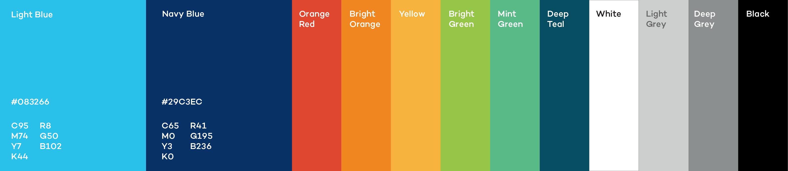

# IISD ggplot colour palette

This repo contains a set of fucntions aimed at creating a version of the IISD colour palette (See included brand identity guidelines document), as well as asociated colour and fill scale functions to be directly used in ggplot.

Ths repo is under construction. Right now i have managed to implement a basic discrete palette with a maximum of 8 colours (the 8 colours that are part of the IISD brand palette). I will continue working to incorporate a colour ramp to the discrete palete which should allow for subdivisions between the colours and, as such, allow for more than 8 categories. Work on the discrete scale itselfe is also in progress.

This implementation is based on a combined aplication of the aproaches presented in [this](https://drsimonj.svbtle.com/creating-corporate-colour-palettes-for-ggplot2) and [this](https://www.garrickadenbuie.com/blog/custom-discrete-color-scales-for-ggplot2/) sources.

<!-- -->
