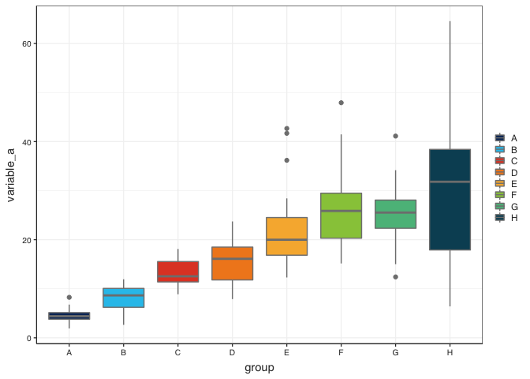
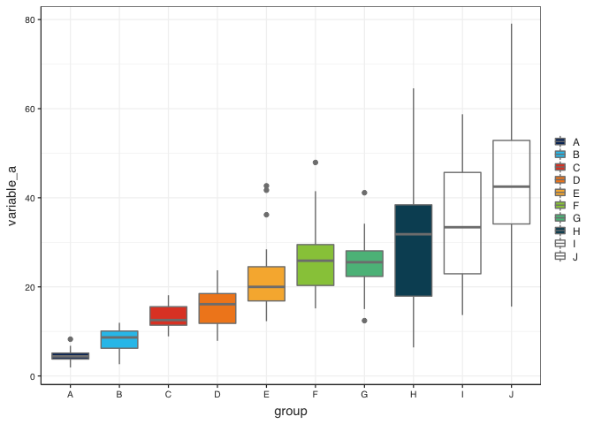

# Required packages

```r
library(tidyverse)
library(here)
library(palmerpenguins)
```

# Formating

Loading and setting iisd ggplot theme an iisd colour palettes


```r
source(here("functions", "theme_iisd_v1.R"))     # Loads the iisd ggplot theme
source(here("functions", "iisd_colours.R"))   # Loads the iisd themed palettes and ggplot scales

theme_set(theme_iisd_v1())  #Sets the theme for all ggplot plots to the iisd theme in this script
```

# Moc data generation

First i am going to create a tibble of fake data so we can play with it. The data will have 8 variables wich is the maximum number of discrete colours the 

```r
dat <- tibble(group = rep(c("A", "B", "C", "D", "E", "F", "G", "H", "I", "J"), each = 20),
              variable_a = rnorm(200, 40, 15) * rep(seq(0.1, 1, 0.1), each = 20),
              variable_b = rnorm(200, 100, 30) * rep(seq(0.1, 1, 0.1), each = 20))
```

# Example plots

The IISD colour palette has only 8 colours, so first i am going to filter my moc data to keep just 8 groups so we can see it in full action


```r
dat %>% 
  filter(group %in% c("A", "B", "C", "D", "E", "F", "G", "H") ) %>% 
  ggplot() +
  geom_boxplot(aes(x = group, y = variable_a, fill = group), colour = "grey50") +
  # geom_point(aes(x = bill_length_mm, y = bill_depth_mm, col = species)) +
  scale_fill_iisd(palette = "iisd_main", discrete = TRUE)
```

<!-- -->
IF we try to apply it shen we have more groupings, it will give us a warning saying that it only has 8 colours and leave any aditional ones blank.


```r
dat %>% 
  ggplot() +
  geom_boxplot(aes(x = group, y = variable_a, fill = group), colour = "grey50") +
  # geom_point(aes(x = bill_length_mm, y = bill_depth_mm, col = species)) +
  scale_fill_iisd(palette = "iisd_main", discrete = TRUE)
```

```
## Warning in f(...): The IISD Discrete Color Palette only has 8 colors.
```

<!-- -->

If we only have two colours it will use the two blue shades in the logo (our primary brand colours)


```r
dat %>% 
  filter(group %in% c("A", "B") ) %>% 
  ggplot() +
  geom_boxplot(aes(x = group, y = variable_a, fill = group), colour = "grey50") +
  # geom_point(aes(x = bill_length_mm, y = bill_depth_mm, col = species)) +
  scale_fill_iisd(palette = "iisd_main", discrete = TRUE)
```

<!-- -->

It works as well as `scale_colour_iisd()`. Once again i am going to filter the dataset so i only keep 8 levels.


```r
dat %>% 
  filter(group %in% c("A", "B", "C", "D", "E", "F", "G", "H") ) %>% 
  ggplot() +
  geom_point(aes(x = variable_a, y = variable_b, col = group)) +
  scale_colour_iisd(palette = "iisd_main", discrete = TRUE)
```

<!-- -->

# Use as a continuous scale

The use as a continuous scale is giving me troube, so i wll continue playing with it until it works.


```r
dat %>% 
  filter(group %in% c("A", "B", "C", "D", "E", "F", "G", "H") ) %>% 
  ggplot() +
  geom_point(aes(x = variable_a, y = variable_b, col = variable_a)) +
  scale_colour_iisd(palette = "iisd_main", discrete = FALSE)
```

```
## Warning in pal(256): The IISD Discrete Color Palette only has 8 colors.
```

<!-- -->


